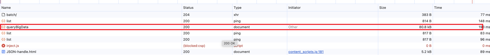
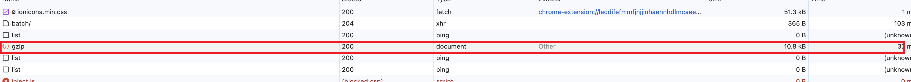
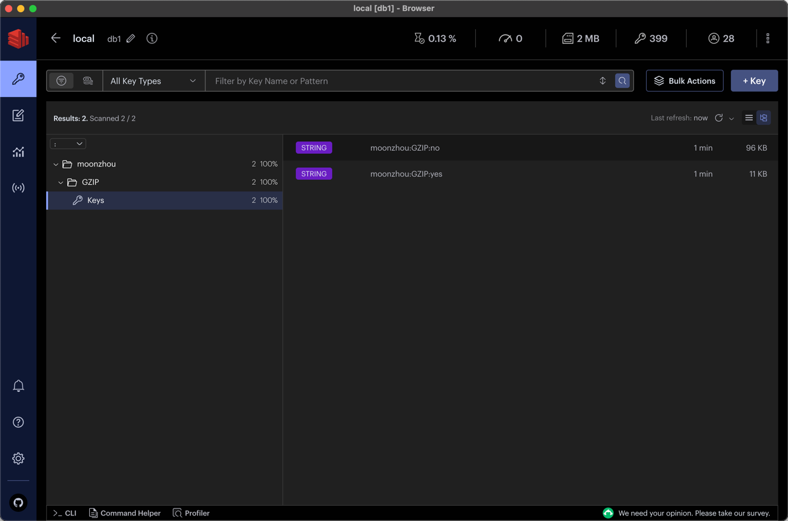

# spring boot gz

## HTTP 请求 gz 压缩返回数据
HTTP协议标准中是直接支持GZIP压缩算法的，通过响应头Content-Encoding: gzip来表明响应内容使用了GZIP压缩，当客户端收到数据后会使用GZIP算法对Body内容进行解压。

> RFC 1952 - IETF（互联网工程任务组）标准化的Gzip文件格式规范
> 
> RFC 2616 - HTTP 1.1 协议规范，其中包括对 Content-Encoding 头的定义

## SpringBoot gz
```
server:
  port: 80
  compression:
    enabled: true
    mime-types:  application/javascript,text/css,application/json,application/xml,text/html,text/xml,text/plain
    min-response-size: 2KB
```

### 测试方法
#### 通用配置
1. yml配置打开
2. 测试方法：`org.moonzhou.springbootgz.controller.UserController.queryBigData`

#### 自定义返回
1. yml配置关闭
2. 测试方法：`org.moonzhou.springbootgz.controller.UserController.gzip`

## redis 存储 gz 压缩
### 测试方法
测试时关闭yml配置
1. 普通测试方法：`org.moonzhou.springbootgz.controller.RedisController.queryBigData`
   
2. 压缩测试后方法：`org.moonzhou.springbootgz.controller.RedisController.gzip`
   




## nginx gz
```
gzip on;
gzip_types text/plain text/css application/json application/javascript text/xml application/xml application/xml+rss text/javascript;
```

## 其他问题记录
### JPA
@GeneratedValue注解在Spring Boot结合JPA的场景中，用于指定实体类的主键生成策略。它主要有以下几种类型，适用于不同的场景：
- `AUTO`：这是默认的策略，JPA会根据使用的数据库自动选择一个合适的主键生成策略。在大多数情况下，它会映射为IDENTITY或SEQUENCE，具体取决于数据库支持。
- `IDENTITY`：适用于支持自动增长字段的数据库，如MySQL、SQL Server等。主键值由数据库自动增长，每次插入新记录时，主键值自动递增。
- `SEQUENCE`：适用于Oracle、PostgreSQL等数据库，主键值通过数据库的序列（sequence）生成。每次需要生成主键时，会从序列中获取下一个值。
- `TABLE`：使用数据库表来存储和管理主键值。这种方式在跨数据库移植性较好，但性能可能略低，因为每次生成主键都需要进行一次数据库查询。
- `UUID`：生成一个全局唯一的标识符（Universally Unique Identifier），适用于需要全局唯一ID的场景，如分布式系统。可以细分为UUID和UUID2，分别对应Java的java.util.UUID和java.security.SecureRandom生成的UUID。

选择哪种策略，主要取决于具体的应用场景和所使用的数据库类型。例如，对于高并发的场景，IDENTITY和SEQUENCE可能更合适，而对于需要跨系统唯一性的场景，UUID则更为适用。

## 参考
1. [带宽和内存降低88%：GZIP在解决Redis大Key方面的应用](https://juejin.cn/post/7410289323737743387)