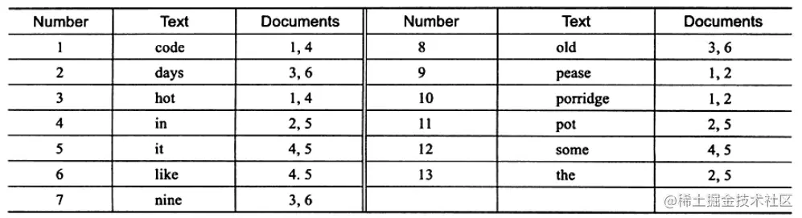
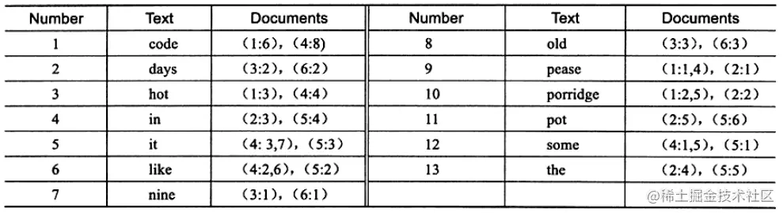

# MYSQL全文索引

## 场景
在模糊查询数据时使用 `%xx` 会导致索引失效，但有时需求就是如此，类似这样的需求还有很多，
例如，搜索引擎需要根据用户数据的关键字进行全文查找，电子商务网站需要根据用户的查询条件，在可能需要在商品的详细介绍中进行查找，这些都不是B+树索引能很好完成的工作。类似系统有博客平台、新闻网站、文档管理系统等。
**此类通过关键字的匹配来进行查询过滤，就需要基于相似度的查询，而不是原来的精确数值比较，全文索引就是为这种场景设计的。**

## 使用
### 开启全文检索
1. 建表时创建
2. 建表后添加：`ALTER TABLE table_name ADD FULLTEXT(column_name);`

### 搜索
语法：
```
MATCH (col1,col2,...) AGAINST (expr [search_modifier])
search_modifier: { IN BOOLEAN MODE | WITH QUERY EXPANSION }
```
1. 使用MATCH AGAINST语句进行全文搜索：
   ```
   -- search_keywords是要搜索的关键词或短语
   SELECT * FROM table_name WHERE MATCH(column_name1, column_name2...) AGAINST('search_keywords1 search_keywords2...');
   ```
2. `MATCH AGAINST` 支持不同的搜索模式，包括自然语言搜索和布尔搜索。
   1. 自然语言搜索会根据关键词的相关性返回结果，相关性越高的记录排在前面。
   2. 布尔搜索允许使用特殊的运算符来指定更复杂的搜索条件，比如“+”表示必须包含，“-”表示必须不包含等。'
      1. 不剔除50%以上符合的row。
      2. 不自动以相关性反向排序。
      3. 可以对没有FULLTEXT index的字段进行搜寻，但会非常慢。
      4. 限制最长与最短的字符串。
      5. 套用Stopwords。
   3. `MATCH(title,content)` 里的字段必须和 `FULLTEXT(title, content)` 里的字段一模一样。 如果只要单查 `title` 或 `content` 一个字段，那得另外再建一个 `FULLTEXT(title)` 或 `FULLTEXT(content)`。


### 示例SQL

```
SELECT a.* FROM Article a WHERE MATCH(a.title, a.content) AGAINST(? IN BOOLEAN MODE)

SELECT a.*, MATCH(a.title, a.content) AGAINST('article 99999') AS title_score FROM Article a WHERE MATCH(a.title, a.content) AGAINST('article 99999' IN BOOLEAN MODE)
```

- SELECT a.*: 选择表 Article 的所有列（* 是通配符）。
- FROM Article a: 指定表名为 Article，并为其取别名 a。
- WHERE MATCH(a.title, a.content) AGAINST(? IN BOOLEAN MODE): 这是全文搜索条件。
  - MATCH(a.title, a.content): 指定要搜索的列为 title 和 content。MATCH 函数用于计算搜索的相关性。
  - AGAINST(? IN BOOLEAN MODE): 指定搜索模式为布尔模式（BOOLEAN MODE），并将搜索关键词作为参数传入（? 是占位符）。

在布尔模式下，全文搜索支持如下操作符：
- `+`：要求字母前面的单词必须存在
- `-`：要求字母前面的单词必须不存在
- `>`：要求字母前面的单词具有更高的相关性（提高该条匹配数据的权重值）
- `<`：要求字母前面的单词具有更低的相关性（降低该条匹配数据的权重值）
- `~`：取消单词的相关性排序，将其相关性由正转负，表示拥有该字会降低相关性(但不像 - 将之排除)，只是排在较后面权重值降低。
- `*`：通配符，匹配任意长度的字符串
- `" "`：用双引号将一段句子包起来表示要完全相符，不可拆字。

```
-- + 表示AND，即必须包含。- 表示NOT，即必须不包含。即：返回记录必需包含 apple，且不能包含 banner。
SELECT * FROM articles WHERE MATCH (title,content) AGAINST ('+apple -banana' IN BOOLEAN MODE);

-- apple和banana之间是空格，空格表示OR。即：返回记录至少包含apple、banana中的一个。
SELECT * FROM articles WHERE MATCH (title,content) AGAINST ('apple banana' IN BOOLEAN MODE);

-- 返回记录必须包含apple，同时banana可包含也可不包含，若包含的话会获得更高的权重。
SELECT * FROM articles WHERE MATCH (title,content) AGAINST ('+apple banana' IN BOOLEAN MODE);

-- ~ 是我们熟悉的异或运算符。返回记录必须包含apple，若也包含了banana会降低权重。
-- 但是它没有 +apple -banana 严格，因为后者如果包含banana压根就不返回。
SELECT * FROM articles WHERE MATCH (title,content) AGAINST ('+apple ~banana' IN BOOLEAN MODE);

-- 返回必须同时包含“apple banana”或者必须同时包含“apple orange”的记录。
-- 若同时包含“apple banana”和“apple orange”的记录，则“apple banana”的权重高于“apple orange”的权重。
SELECT * FROM articles WHERE MATCH (title,content) AGAINST ('+apple +(>banana < orange)' IN BOOLEAN M
```

例如，如果要搜索标题或内容中包含关键词 hello 和 world，语句变为：
```
SELECT a.* FROM Article a WHERE MATCH(a.title, a.content) AGAINST('hello +world' IN BOOLEAN MODE)
```
这条语句将返回标题或内容中同时包含 hello 和 world 的所有文章。


## 底层逻辑
### 倒排/反向索引
全文检索通常使用倒排索引（inverted index）来实现，倒排索引同 B+Tree 一样，也是一种索引结构。它在辅助表中存储了单词与单词自身在一个或多个文档中所在位置之间的映射，这通常利用关联数组实现，拥有两种表现形式：
- inverted file index：{单词，单词所在文档的id}
- full inverted index：{单词，（单词所在文档的id，再具体文档中的位置）}


上图为 `inverted file index` 关联数组，可以看到其中单词"code"存在于文档1,4中，这样存储再进行全文查询就简单了，可以直接根据 Documents 得到包含查询关键字的文档；
而 `full inverted index` 存储的是对，即（DocumentId,Position），因此其存储的倒排索引如下图，如关键字"code"存在于文档1的第6个单词和文档4的第8个单词。
相比之下，`full inverted index` 占用了更多的空间，但是能更好的定位数据，并扩充一些其他搜索特性。


### 索引创建过程
在 MySQL 中，全文检索使用的是一种称为“n-gram”的技术。n-gram 是一种将文本拆分为一系列的 n 个连续字符的方法。例如，“hello”可以被拆分为以下 5 个 1-gram：h-e-l-l-o。

MySQL 中的全文检索索引使用以下步骤构建：
- 分词（Tokenization）：将文本分解为单词或 n-gram。
- 停用词（Stopwords）：去除常见的无意义词，如“the”、“and”等。
- 词干提取（Stemming）：将单词转换为其词干形式，以减少词形的变化。
- 索引构建（Indexing）：将处理后的单词或 n-gram 存储在反向索引中。

当执行全文检索查询时，MySQL 会将查询条件分解为单词或 n-gram，并在反向索引中查找匹配的文档。

MySQL 支持两种全文检索模式：
- 自然语言模式（Natural Language Mode）：使用反向索引和 n-gram 技术实现全文检索。
- 布尔模式（Boolean Mode）：使用布尔运算符（如 AND、OR、NOT）实现全文检索。

## 总结
### MySQL 全文搜索的优点
1. 高效性：能够快速在大量文本数据中找到匹配的记录，大大提高了搜索效率。
2. 灵活性：支持自然语言搜索和布尔搜索等多种搜索模式，可以满足不同的搜索需求。
3. 易于使用：通过简单的 SQL 语句即可实现全文搜索，无需复杂的编程。
4. 适用性广：适用于各种类型的应用程序，尤其是那些需要处理大量文本数据的应用。

### MySQL 全文搜索的缺点
1. 资源消耗：全文搜索可能会消耗较多的系统资源，特别是在处理大规模数据时，可能会影响数据库的性能。
2. 索引维护：全文索引需要定期维护，以确保其有效性。这可能会增加数据库管理的工作量。
3. 不支持复杂的语言分析：对于一些复杂的语言，如中文的分词等，MySQL 的全文搜索可能无法提供非常准确的结果。
4. 有限的搜索功能：与专门的搜索引擎相比，MySQL 的全文搜索功能相对较为有限，可能无法满足一些高级搜索需求。

### 性能优化
全文搜索可能会消耗较多的资源，特别是在处理大量数据时。以下是一些性能优化的建议：
- 定期重建全文索引，以确保索引的有效性。
- 避免在非常大的表上进行频繁的全文搜索，可以考虑使用缓存或其他技术来提高性能。
- 合理调整 `MySQL` 的缓存设置，以提高查询的响应速度。


## 注意事项
1. `MySQL` 版本：确保你使用的 `MySQL` 版本支持 `FULLTEXT` 索引。
   1. 全文索引只能在 `InnoDB` 或 `MyISAM` 的表上使用，并且只能用于创建 `char,varchar,text` 类型的列。
   2. 在早期的 `MySQL` 中，`InnoDB` 并不支持全文检索技术，从 `MySQL 5.6` 开始，`InnoDB` 开始支持全文检索。在 `MySQL 5.6` 以下，只有 `MyISAM` 表支持全文检索。
2. 索引大小：对于非常大的文本字段，`FULLTEXT` 索引可能会占用大量磁盘空间。
3. 性能：在大数据集上，全文检索可能会变慢。考虑使用更高级的搜索引擎（如`Elasticsearch`）来提高性能。
4. 安全性：确保你的查询参数是安全的，以防止`SQL注入攻击`。在这个示例中，由于使用了 `Spring Data JPA` 的 `@Param` 注解和 `nativeQuery`，SQL注入的风险已经降低。

## 其他
### 清除Gradle缓存，然后重新构建
```
jdk21
./gradlew clean build --refresh-dependencies
```

## 参考
1. [MySQL 的全文搜索功能详解](https://blog.csdn.net/u010223407/article/details/142822034)
2. [MySQL全文检索](https://www.cnblogs.com/gimin/p/7086706.html)
3. [聊聊Mysql中的全文检索](https://blog.csdn.net/qq_28165595/article/details/132651927)