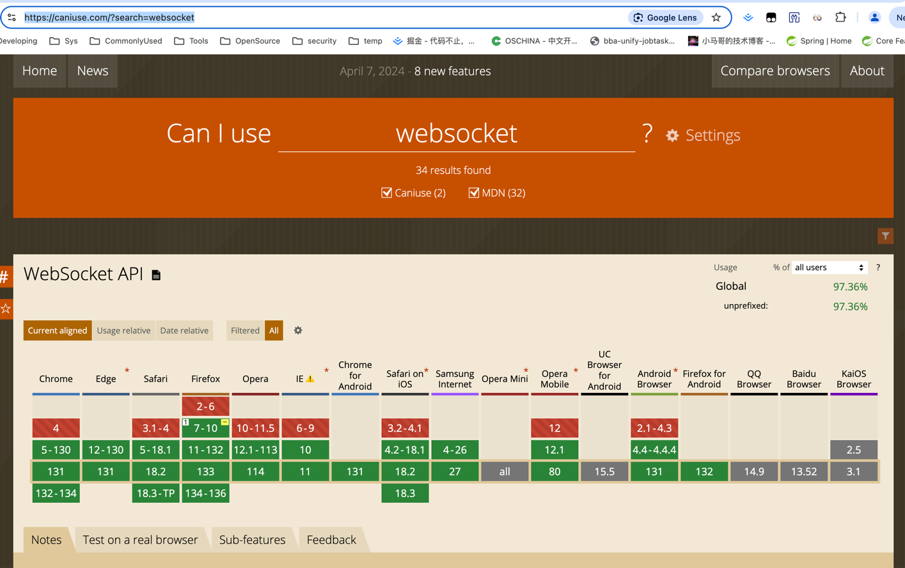

# Spring Boot Server Sent Event

## 简介

在实际开发项目中，实时通讯是常见的需求，需要服务端主动推送给客户端数据。比如数据大屏的实时数据，比如消息中心的未读消息，比如聊天功能等等。

常规实现这些需求的方案有以下三种：

- 轮询
- websocket
- SSE

| **特性**        | **SSE (Server-Sent Events)** | **轮询 (Polling)**      | **WebSocket**              |
|---------------|------------------------------|-----------------------|----------------------------|
| **通讯方向**      | 单向：服务器向客户端推送数据               | 单向：客户端定时请求服务器获取数据     | 双向：客户端与服务器双向通讯             |
| **连接类型**      | 长连接：使用 HTTP/1.1 或 HTTP/2 长连接 | 短连接：每次请求都是独立的 HTTP 请求 | 长连接：通过 TCP 建立的持久连接         |
| **传输协议**      | HTTP/1.1 或 HTTP/2            | HTTP                  | TCP（通过 WebSocket 协议升级）     |
| **浏览器支持**     | 广泛支持（HTML5 原生支持）             | 全面支持，所有浏览器均支持         | 广泛支持（需通过 WebSocket API 实现） |
| **消息发送频率**    | 服务器可随时推送数据                   | 客户端主动定时请求，频率取决于客户端设置  | 实时、即时双向发送                  |
| **服务器开销**     | 较低：只需保持一个长连接                 | 高：每次请求都需要重新建立 HTTP 连接 | 较高：需保持 TCP 连接，管理心跳包        |
| **客户端开销**     | 低：只需处理服务器推送的数据               | 高：每次请求都会产生额外的资源消耗     | 中等：需保持与服务器的连接              |
| **传输数据格式**    | 纯文本、JSON 等                   | 纯文本、JSON 等            | 任意格式（二进制、文本等）              |
| **连接恢复机制**    | 自动恢复：连接中断时，客户端会自动重新连接        | 无自动恢复，需客户端重新发起请求      | 需开发者自行实现重连机制               |
| **适用场景**      | 适合实时数据推送、通知、监控等单向通讯场景        | 适用于低频率、对实时性要求不高的场景    | 适合即时通讯、协作应用等双向通讯场景         |
| **复杂度**       | 简单：实现轻量且代码量少                 | 简单：代码量少，但性能较差         | 复杂：需处理更多逻辑，如握手、心跳等         |
| **实时性**       | 高：服务器可立即推送消息                 | 低：依赖客户端的请求频率          | 高：双向即时通讯                   |
| **防火墙/代理兼容性** | 高：使用标准 HTTP 协议，通常无额外配置需求     | 高：使用标准 HTTP 协议        | 可能较低：需配置防火墙或代理来允许 TCP 连接   |
| **带宽消耗**      | 较低：保持长连接，但只在有数据时传输           | 较高：每次轮询都会消耗资源和带宽      | 较低：保持长连接，数据按需传输            |


## 实现方案

### 轮询
#### 简介
很久以前，前端一般使用轮询来进行服务端向客户端进行消息的伪推送，为什么说轮询是伪推送？
因为轮询本质上还是通过客户端向服务端发起一个单项传输的请求，服务端对这个请求做出响应而已。
通过不断的请求来实现服务端向客户端推送数据的错觉。并不是服务端主动向客户端推送数据。

**显然，轮询一定是上述三个方法里最下策的决定。**

#### 缺点
- 轮询需要不断的发起请求，每一个请求都需要经过http建立连接的流程（比如三次握手，四次挥手），是没有必要的消耗。
- 客户端需要从页面被打开的那一刻开始就一直处理请求。虽然每次轮询的消耗不大，但是一直处理请求对于客户端来说一定是不友好的。
- 浏览器请求并发是有限制的。比如Chrome 最大并发请求数目为 6，这个限制还有一个前提是针对同一域名的，超过这一限制的后续请求将会被阻塞。而轮询意味着会有一个请求长时间的占用并发名额。
- 接口响应时间与轮询频率问题：如果轮询时间较长，可能又没有办法非常及时的获取数据

### Web Socket
#### 简介
双向通讯的协议，可以同时支持客户端和服务端彼此相互进行通讯。

#### 缺点
websocket是一个新的协议，`ws/wss`。也就是说，支持http协议的浏览器不一定支持ws协议。[浏览器支持该协议列表](https://caniuse.com/?search=websocket)



### SSE
#### 简介
单向通讯的协议也是一个长链接，它只能支持服务端主动向客户端推送数据，但是无法让客户端向服务端推送消息。

#### 优点
1. 长链接是一种HTTP/1.1的持久连接技术，它允许客户端和服务器在一次TCP连接上进行多个HTTP请求和响应，而不必为每个请求/响应建立和断开一个新的连接。长连接有助于减少服务器的负载和提高性能。
2. SSE的优点是，它是一个轻量级的协议，相对于websockte来说，他的复杂度就没有那么高，相对于客户端的消耗也比较少。而且SSE使用的是http协议（websocket使用的是ws协议），也就是现有的服务端都支持SSE，无需像websocket一样需要服务端提供额外的支持。

注意:IE不支持SSE，小程序不支持SSE。


## 集成 Spring Boot

以下是一份关于如何在Spring Boot中使用`text/event-stream`的用法说明文档：

### 一、概述

`text/event-stream` 是一种MIME类型，用于实现服务器发送事件（Server-Sent Events，SSE）。在Spring Boot中，你可以使用这种类型来创建实时数据推送的应用程序。SSE允许服务器主动向客户端发送更新，而无需客户端不断轮询服务器。

### 二、配置与依赖

1. **引入依赖**：
   如果你使用的是Spring Boot的WebFlux模块，那么你需要确保在`pom.xml`中引入了`spring-boot-starter-webflux`依赖。

   ```xml
   <dependency>
       <groupId>org.springframework.boot</groupId>
       <artifactId>spring-boot-starter-webflux</artifactId>
   </dependency>
   ```
2. **启用异步支持**：
   SSE通常需要异步处理，因此你需要在Spring Boot中启用异步支持。可以通过在配置类上添加`@EnableAsync`注解来实现。

   ```java
   @Configuration
   @EnableAsync
   public class AsyncConfig {
       // 配置类内容
   }
   ```

### 三、创建SSE控制器

1. **定义控制器**：
   创建一个Spring Boot控制器，该控制器将返回一个实时的事件流。使用`@GetMapping`注解来定义一个API接口，并设置`produces`属性为`MediaType.TEXT_EVENT_STREAM_VALUE`。

   ```java
   @RestController
   @RequestMapping("/sse")
   public class SseController {

       @GetMapping(produces = MediaType.TEXT_EVENT_STREAM_VALUE)
       public Flux<String> handleSse() {
           // 返回一个Flux<String>，其中每个字符串都是一个事件
           return Flux.interval(Duration.ofSeconds(1)) // 每秒产生一个数据
                   .map(l -> "data: Event " + l + "\n\n"); // 将长整型数据转换为字符串，并添加"data: "前缀和换行符
       }
   }
   ```
2. **使用SseEmitter**：
   `SseEmitter`是Spring提供的一个类，用于处理SSE流。你可以利用它来异步地向客户端推送数据。

   ```java
   @RestController
   @RequestMapping("/sse-emitter")
   public class SseEmitterController {

       @GetMapping(produces = MediaType.TEXT_EVENT_STREAM_VALUE)
       public SseEmitter handleSseEmitter() {
           SseEmitter emitter = new SseEmitter();

           // 启动一个新的线程模拟定期推送事件
           new Thread(() -> {
               try {
                   for (int i = 0; i < 10; i++) {
                       emitter.send("data: Event " + i + "\n\n"); // 向客户端发送数据
                       Thread.sleep(1000); // 每秒发送一次
                   }
                   emitter.complete(); // 发送完毕后，标记事件流完成
               } catch (Exception e) {
                   emitter.completeWithError(e); // 如果出现异常，标记事件流出错
               }
           }).start();

           return emitter; // 返回SseEmitter实例，它会处理异步流式数据
       }
   }
   ```

### 四、前端接收SSE

在前端，你可以使用JavaScript的`EventSource`对象来接收服务器推送的事件。这个对象会保持与服务器的连接，一旦有新的事件，浏览器会自动处理。

```html
<!DOCTYPE html>
<html lang="en">
<head>
    <meta charset="UTF-8">
    <title>Server-Sent Events Example</title>
</head>
<body>
    <h1>Server-Sent Events Example</h1>
    <div id="messages"></div>
    <script>
        // 创建一个EventSource对象，连接到/sse接口
        const eventSource = new EventSource("/sse");

        // 每当接收到数据时，处理该事件
        eventSource.onmessage = function(event) {
            const messagesDiv = document.getElementById('messages');
            const message = document.createElement('p');
            message.textContent = event.data;
            messagesDiv.appendChild(message);
        };

        // 错误处理
        eventSource.onerror = function(error) {
            console.error("EventSource failed:", error);
        };
    </script>
</body>
</html>
```

### 五、注意事项

1. **字符编码**：确保在响应中设置了正确的字符编码，以避免中文乱码等问题。
2. **异常处理**：在推送数据时，要妥善处理可能出现的异常，以避免事件流中断。
3. **资源释放**：在事件流完成后，要释放相关资源，以避免资源泄漏。

通过以上步骤，你可以在Spring Boot中成功实现SSE，并创建一个实时数据推送的应用程序。

## 参考

1. [](https://mp.weixin.qq.com/s/MSbHC7Af7Jh-k9rv33miog)
2. [](https://mp.weixin.qq.com/s/VKTjEX2o-7r3nhzXliDJ4g)
