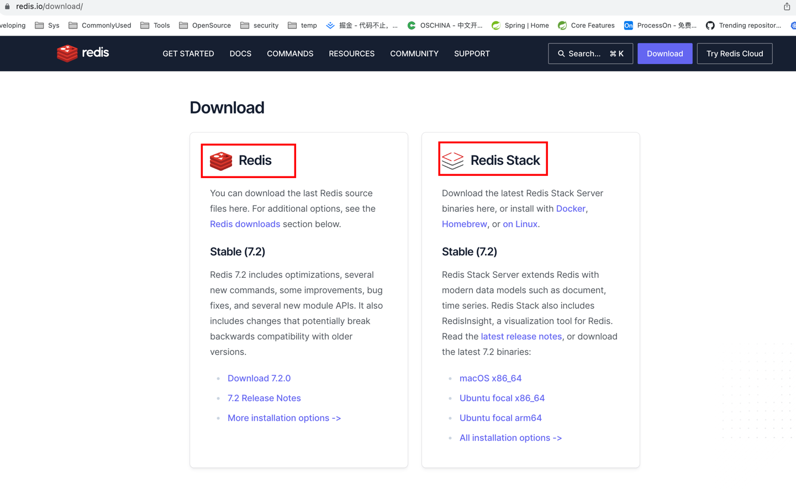

# redis om

## 环境搭建
根据[官方安装说明](https://redis.io/docs/getting-started/install-stack/)，选择适合自己的环境进行安装即可。
需要说明的是，`Redis`和`Redis Stack`是有区别的，使用`redis om`需要安装`Redis Stack`！！！


### 说明
- `redis/redis-stack`： 是一组软件套件，包含`Redis Stack Server`,`Redis Stack 客户端 SDK`和`RedisInsight`，最适用于本地开发者，可以使用内置的RedisInsigt对数据可视化。
  > 其中 Redis Stack Server 由 Redis，RedisSearch，RedisJSON，RedisGraph，RedisTimeSeries 和 RedisBloom 组成。
  > 
  > 其目的：基于Redis的搜索、文档、图和时间序列功能整合到一个扩展Redis Stack中，以使开发人员能够轻松构建实时应用程序。
- `redis/redis-stack-server`： 只提供redis stack服务，最适用于生产部署。


## 使用方式
1. 引入依赖（注意版本）：包含springboot，redis om以及swagger。
2. 创建domain，以及对应repository。
3. 开启redis repository：`@EnableRedisDocumentRepositories(basePackages = "org.moonzhou.redisom.*")`，`@EnableRedisEnhancedRepositories`，注意目录为application类所在目录。
4. 配置swagger。
5. 编写controller接口，为简化，直接调用repository，实际开发过程，根据需要创建service。
   
6. 测试：[示例访问地址](http://localhost:8080/swagger-ui/index.html)


## 其他使用方式
1. 与JPA类似，根据方法名称自动实现查询逻辑的衍生查询
   
2. 


## 注意点
1. 注意redis om与之对应的springboot版本，以及其他组件比如swagger的版本，尤其是springboot3之后。
2. 因为没有正确构建环境（安装`redis-stack-server`），导致`redis om`操作的时候，会报各类的命令不支持。（遇到问题先查看redis是否启动，服务是否正常。）
   ```
   # 查看redis服务
   brew service list
   ps -ef | grep redis
   # 确认服务是否正常
   redis-cli -h localhost -p 6379
   info
   
   # 错误记录
   redis.clients.jedis.exceptions.JedisDataException: ERR unknown command 'FT.DROPINDEX', with args beginning with: 'org.moonzhou.redisom.domain.ProductIdx' 'DD'
   redis.clients.jedis.exceptions.JedisDataException: ERR unknown command 'JSON.SET'
   ```
3. springboot3之后，redis配置在`spring.data`下。
4. 并不是所有redis功能，clint api都支持
   


## 参考
1. [Redis OM Spring](https://redis.io/docs/clients/om-clients/stack-spring/)
2. [官方源码及示例](https://github.com/redis/redis-om-spring)
