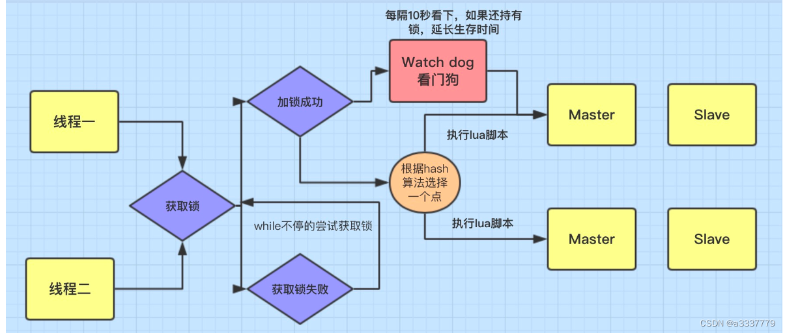

# redission

> Redisson - Easy Redis Java client with features of In-Memory Data Grid. 
> Sync/Async/RxJava/Reactive API. 
> Over 50 Redis based Java objects and services: Set, Multimap, SortedSet, Map, List, Queue, Deque, Semaphore, Lock, AtomicLong, Map Reduce, Bloom filter, Spring Cache, Tomcat, Scheduler, JCache API, Hibernate, RPC, local cache ...

Redisson是一个在Redis的基础上实现的Java驻内存数据网格（In-Memory Data Grid）。它不仅提供了一系列的分布式的Java常用对象，还提供了许多分布式服务。
其中包括(BitSet, Set, Multimap, SortedSet, Map, List, Queue, BlockingQueue, Deque, BlockingDeque, Semaphore, Lock, AtomicLong, CountDownLatch, Publish / Subscribe, Bloom filter, Remote service, Spring cache, Executor service, Live Object service, Scheduler service) 
Redisson提供了使用Redis的最简单和最便捷的方法。Redisson的宗旨是促进使用者对Redis的关注分离（Separation of Concern），从而让使用者能够将精力更集中地放在处理业务逻辑上。（底层使用netty框架）

## 分布式锁
### 可重入锁
### 读写锁
1. 读+读：相当于无锁，并发读情况下，只会在 redis 中记录好，所有当前的读锁，他们都会加锁成功。
2. 写+读：等待写锁释放
3. 写+写：阻塞方式
4. 读+写：有读锁，写也需要等待
### 公平锁
### 信号量
### 闭锁

## 延迟队列
redission.delayqueue.enable=true

## 源码(source code)
### 释放锁
看门狗机制

## 参考
1. [官网](https://github.com/redisson/redisson)