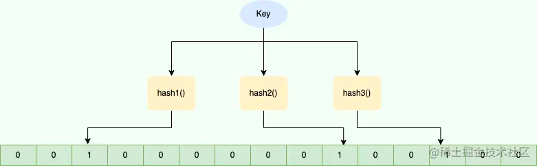
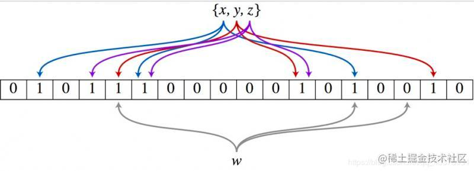
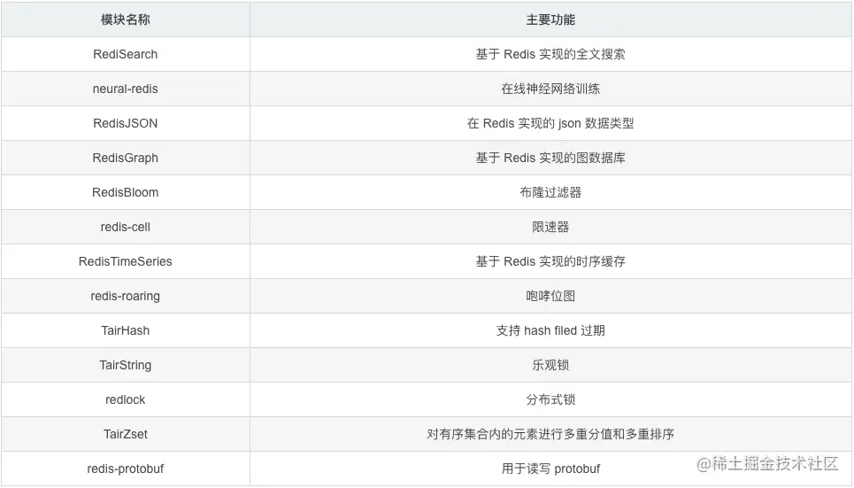

# 布隆过滤器(Bloom Filter)

## 介绍（是什么）
布隆过滤器（Bloom Filter）是1970年由布隆提出来的。 它实际上是由一个很长的二进制数组+一系列hash算法映射函数(二进制向量)，用于判断一个元素是否存在于集合中。
它的优点是空间效率和查询时间都比一般的算法要好的多，缺点是有一定地误识别率和删除困难。理论情况下添加到集合中的元素越多，误报的可能性就越大。

Bloom Filter 会使用一个较大的 bit 数组来保存所有的数据，数组中的每个元素都只占用 1 bit ，并且每个元素只能是 0 或者 1（代表 false 或者 true），这也是 Bloom Filter 节省内存的核心所在。
这样来算的话，申请一个 100w 个元素的位数组只占用 1000000Bit / 8 = 125000 Byte = 125000/1024 kb ≈ 122kb 的空间。数据结构如下：


## 原理
### 添加数据
1. 使用布隆过滤器中的哈希函数对元素值进行计算，得到哈希值（有几个哈希函数得到几个哈希值）。
2. 根据得到的哈希值，在位数组中把对应下标的值置为 1。

### 判断数据
1. 对给定元素再次进行相同的哈希计算；
2. 得到值之后判断位数组中的每个元素是否都为 1，如果值都为 1，那么说明这个值在布隆过滤器中(可能误判)，如果存在一个值不为 1，说明该元素不在布隆过滤器中。





## 特点
- 插入和查询效率高，占用空间少，但是返回的结果是不确定的。
- 一个元素如果判断为存在的时候，它不一定真的存在(**误判**)。但是如果判断一个元素不存在，那么它一定是不存在的。
- 布隆过滤器可以添加元素，但是一定不能删除元素，会导致误判率增加。（正是因为hash冲突，可能多个值计算的hash值是一样的）


## 场景
- 判断给定数据是否存在
  - 比如判断一个数字是否存在于包含大量数字的数字集中（数字集很大，上亿）
  - 防止缓存穿透（判断请求的数据是否有效避免直接绕过缓存请求数据库）
  - 邮箱的垃圾邮件过滤（判断一个邮件地址是否在垃圾邮件列表中）
  - 黑名单功能（判断一个IP地址或手机号码是否在黑名单中）
  - 假设有10亿条手机号，然后判断某条手机号是否在列表内？
- 去重
    - 网页爬虫对URL去重，避免爬取相同的 URL 地址。
    - 用户日常刷新闻，每次推荐给该用户的内容不能重复，过滤已经看过的内容。


## 一些实现
### Java实现
```
// 实现
org.moonzhou.bloomfilter.MyBloomFilter

// 测试
org.moonzhou.bloomfilter.BloomFilterTest
```

### Guava
```
<dependency>
    <groupId>com.google.guava</groupId>
    <artifactId>guava</artifactId>
    <version>32.1.1-jre</version>
</dependency>

// 使用
org.moonzhou.bloomfilter.GuavaBloomFilterTest
```

### hutool
```
<dependency>
    <groupId>cn.hutool</groupId>
    <artifactId>hutool-all</artifactId>
    <version>5.8.20</version>
</dependency>

// 使用
org.moonzhou.bloomfilter.HutoolBloomFilterTest
```

### redisson
```
<dependency>
    <groupId>org.redisson</groupId>
    <artifactId>redisson</artifactId>
    <version>3.23.1</version>
</dependency>

// 使用
org.moonzhou.bloomfilter.RedissonBloomFilterTest
```

如上不同的实现，都有各自的特点：
1. Guava：基于JVM内存的一种布隆过滤器，重启即失效，本地内存无法用在分布式场景，不支持大数据量存储（另外，容量扩展也不容易）
2. redisson：
   - 基于redis，适合分布式场景，大数据量
   - 缺点：需要网络IO，性能比Google布隆过滤器低

## 软实现
### Mysql
基于bloom filter的原理，核心为存储和判断两部。
**正常情况下，如果数据量不大，我们可以考虑使用mysql存储。（演进而非设计）**将所有数据存储到数据库，然后每次去库里查询判断是否存在。
但是如果数据量太大，超过千万，mysql查询效率是很低的，特别消耗性能。

### HashMap / HashSet
也可以把数据放入HashSet中，利用HashSet天然的去重性，查询只需要调用contains方法即可，但是hashset是存放在内存中的，数据量过大内存直接oom了。
同时这种JVM内存方式都是单机模式，无法支持分布式的系统，而且重启后都会丢数据。

### Redis
Redis v4.0 之后有了 Module（模块/插件）功能，Redis Modules 让 Redis 可以使用外部模块扩展其功能 ，使用户可以根据需要额外集成一些实用功能。
[详情传送门](https://redis.io/resources/modules/)


官网推荐了 RedisBloom 作为 Redis 布隆过滤器的 Module，其他还有：
- [redis-lua-scaling-bloom-filter（lua 脚本实现）](https://github.com/erikdubbelboer/redis-lua-scaling-bloom-filter)
- [pyreBloom（Python 中的快速 Redis 布隆过滤器）](https://github.com/seomoz/pyreBloom)

[Docker安装](https://hub.docker.com/r/redislabs/rebloom/)，具体操作如下：
```
~ docker run -p 6379:6379 --name redis-redisbloom redislabs/rebloom:latest
~ docker exec -it redis-redisbloom bash
root@21396d02c252:/data# redis-cli
```

其他方式安装：
1. github下载[模块源码](https://github.com/RedisBloom/RedisBloom)
2. 本地编译（make）
3. 修改redis.conf，添加`loadmodule /Users/valley/RedisBloom-2.2.14/redisbloom.so`，或者使用启动命令`redis-server /usr/local/etc/redis.conf --loadmodule /Users/valley/RedisBloom-2.2.14/redisbloom.so`
4. homebrew方式
   ```
   $ brew services
   Name          Status     User     File
   redis         started    xxxx ~/Library/LaunchAgents/homebrew.mxcl.redis.plist
   
   $ more ~/Library/LaunchAgents/homebrew.mxcl.redis.plist
   ...
   <array>
          <string>/opt/homebrew/opt/redis/bin/redis-server</string>
          <string>/opt/homebrew/etc/redis.conf</string>
   </array>
   ...
   
   # 配置加载loadmodule
   $ vim /opt/homebrew/etc/redis.conf
   # loadmodule /path/to/my_module.so
   # loadmodule /path/to/other_module.so
   ```

使用命令：
1. **BF.ADD** ：将元素添加到布隆过滤器中，如果该过滤器尚不存在，则创建该过滤器。格式：`BF.ADD {key} {item}`。
2. **BF.MADD**  : 将一个或多个元素添加到“布隆过滤器”中，并创建一个尚不存在的过滤器。该命令的操作方式BF.ADD与之相同，只不过它允许多个输入并返回多个值。格式：`BF.MADD {key} {item} [item ...]` 。
3. **BF.EXISTS** : 确定元素是否在布隆过滤器中存在。格式：`BF.EXISTS {key} {item}`。
4. **BF.MEXISTS** ： 确定一个或者多个元素是否在布隆过滤器中存在格式：`BF.MEXISTS {key} {item} [item ...]`。

另外，`BF.RESERVE` 命令需要单独介绍一下：
这个命令的格式如下：
```
# key：布隆过滤器的名称
# error_rate :误报的期望概率。这应该是介于0到1之间的十进制值。例如，对于期望的误报率0.1％（1000中为1），error_rate应该设置为0.001。该数字越接近零，则每个项目的内存消耗越大，并且每个操作的CPU使用率越高。
# capacity: 过滤器的容量。当实际存储的元素个数超过这个值之后，性能将开始下降。实际的降级将取决于超出限制的程度。随着过滤器元素数量呈指数增长，性能将线性下降。
# 可选参数：expansion：如果创建了一个新的子过滤器，则其大小将是当前过滤器的大小乘以expansion。默认扩展值为2。这意味着每个后续子过滤器将是前一个子过滤器的两倍。
BF.RESERVE {key} {error_rate} {capacity} [EXPANSION expansion] 

# 示例
bf.reserve user 0.01 100
```

```
127.0.0.1:6379> BF.ADD myFilter java
(integer) 1
127.0.0.1:6379> BF.ADD myFilter javaguide
(integer) 1
127.0.0.1:6379> BF.EXISTS myFilter java
(integer) 1
127.0.0.1:6379> BF.EXISTS myFilter javaguide
(integer) 1
127.0.0.1:6379> BF.EXISTS myFilter github
(integer) 0
```


### 总结
系统架构是演进出来的，而非设计出来的。设计时如何保持其合理性，不做过度设计，同时还需要保持警惕，避免出现经验主义的错误。（什么话都让你说了～～）


## 参考
1. [java实现布隆过滤器](https://juejin.cn/post/7215454015713919031)
2. [聊聊布隆过滤器](https://juejin.cn/post/7246777535042912312)
3. [Google布隆过滤器与Redis布隆过滤器详解](https://juejin.cn/post/6844904004527341582)
4. [布隆过滤器](https://juejin.cn/post/6893337211207434247)