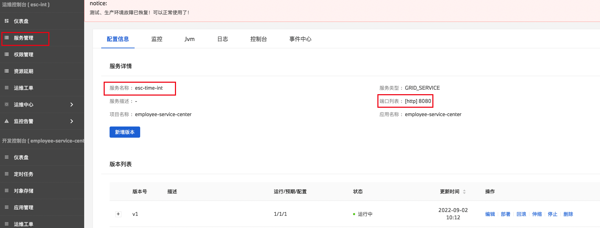
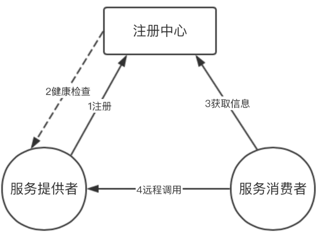

## Feign in k8s microservice

按照目前的云迁移方案，业务上将同类型的小应用进行合并，而技术架构上采用微服务的方式进行开发，最终应用的服务通过某DevOps进行发布。

采用微服务的方式，必然会涉及到服务间调用，而技术架构给的方案是使用Feign。现总结Feign的在k8s微服务下的使用方式。

### 注册中心

实现服务的注册，发现，检查等功能。

服务注册：微服务在启动时，将自己的服务信息注册到注册中心。

服务发现：新注册的这个服务模块能够及时的被其他调用者发现。

**在DevOps平台上，应用使用k8s容器管理技术，k8s提供服务发现能力，所以对于像Eureka的注册中心是不需要的。**

### 服务提供者

springboot应用，正常启动服务即可，启动后，会自动以服务名的方式将自己的服务注册到K8S，服务名为DevOps平台上配置的服务名。

springboot里的http接口，均可以通过被消费者进行调用，在K8S下的微服务里，该角色已经被弱化。示例代码（普通的Controller）：`org.moonzhou.springcloudlearning.feign.provider.openapi.ProviderDemoController`

### 服务消费者

1. 在启动类上添加注解：`@EnableFeignClients`。示例代码：`org.moonzhou.springcloudlearning.feign.consumer.SpringCloudFeignConsumerApplication`
2. 编写外部服务对应的Feign客户端接口，目的是将依赖的服务映射为本地的方法，核心为`@FeignClient`的格式，`@FeignClient(name="any", url = "[http://service-name:port](http://service-nameport/)")`。示例代码：`org.moonzhou.springcloudlearning.feign.consumer.client.ProviderDemoClient`
3. 使用Feign客户端接口进行调用，业务逻辑中调用第二步映射的本地方法。示例代码：`org.moonzhou.springcloudlearning.feign.consumer.controller.ConsumerDemoController.call`

### 总结

1. 分布式下的微服务间的调用过程如上图，但是在K8S下的微服务应用，利用K8S本身的服务发现，从而弱化了注册中心和服务提供者在开发中的配置。另外示例中未对异常情况处理做测试，实际开发中，**需要开发根据业务场景做好异常情况的处理**。
2. feign的底层调用还是http，将本地调用接口的方式，最终转换成为http接口的方式进行调用，让开发者更友好的进行接口调用。
3. 服务的客户端端接口，理论上是由服务提供者编写，别写完成后，通过maven等方式部署到公司的私服仓库里，供调用方进行使用。服务客户端除了包含接口之外，还需要包括封装的入参以及返回。