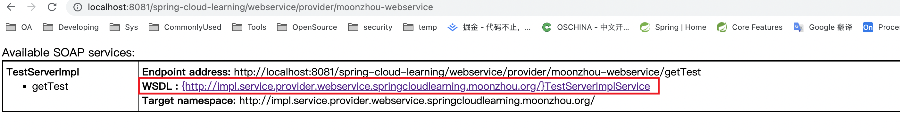
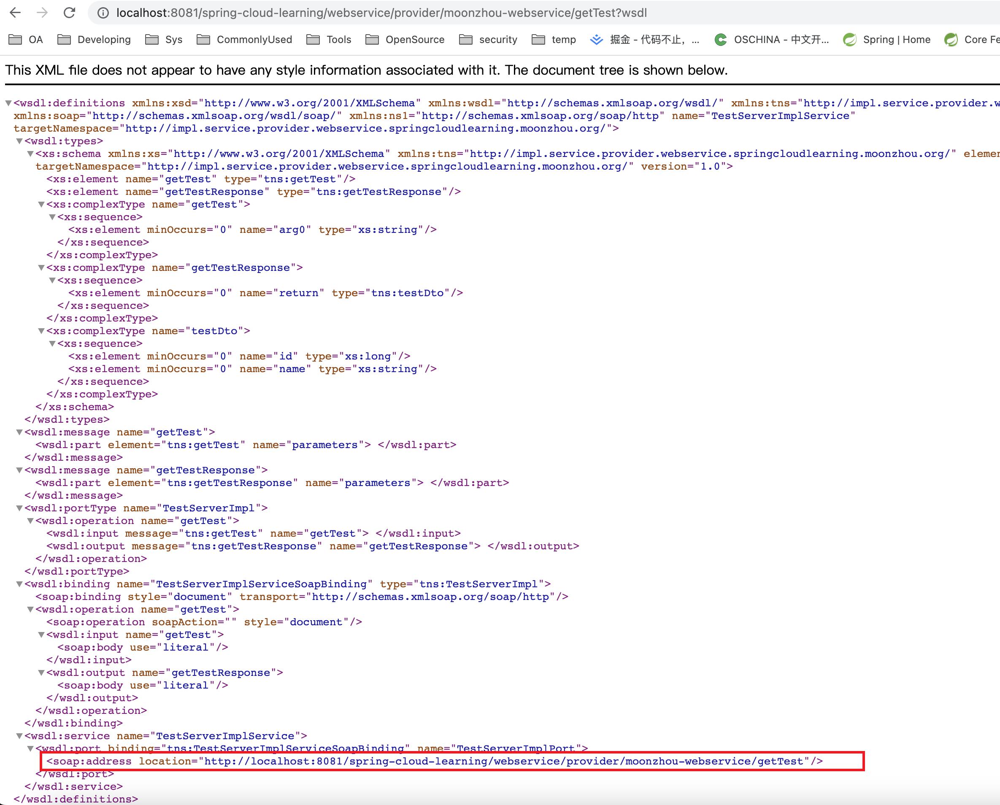
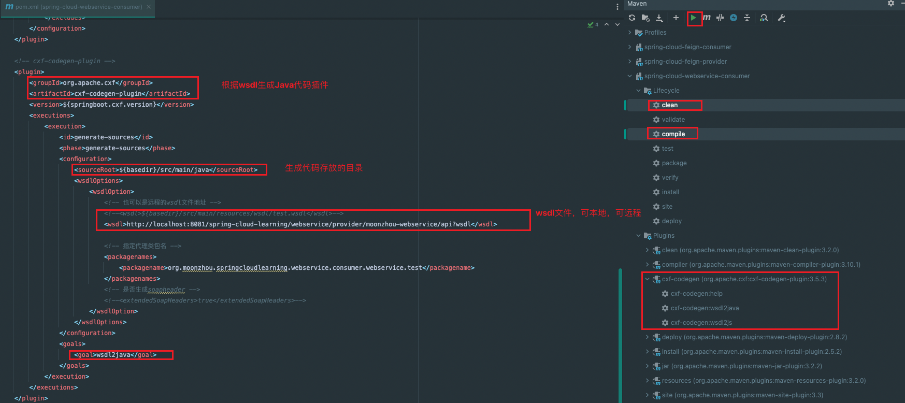

## Web Service in springboot

### 背景
公司现有的应用系统，很多直接部署在虚机上，而且底层的存储（中台职能）都是通过SAP提供的服务。为了更好的实现系统的DevOps，计划对相关应用进行上云操作。
同时对系统进行架构升级，使用分布式架构，k8s部署。

原计划SAP的服务也需要同步进行升级，但是由于工作量以及计划排期问题，优先做应用的上云，SAP服务不做优化，还是以`Web Service`的方式对外提供服务。因此整理了在springboot下`Web Service`的使用。

### Web Service使用方式
服务端和客户端引入依赖
```
<dependency>
    <groupId>org.apache.cxf</groupId>
    <artifactId>cxf-spring-boot-starter-jaxws</artifactId>
    <version>${springboot.cxf.version}</version>
</dependency>
```

### 服务端
1. 普通的接口及实现类，需要添加注解：`@Service`和`@WebService`。示例代码目录：`org.moonzhou.springcloudlearning.webservice.provider.service`
2. 添加spring配置：注册servlet，发布endpoint。示例代码：`org.moonzhou.springcloudlearning.webservice.provider.config.CxfConfig`
3. 访问服务地址（环境上下文+第二步里面注册的cxf servlet）：`http://localhost:8081/spring-cloud-learning/webservice/provider/moonzhou-webservice`
   
4. 具体的接口详情（wsdl文档）：点击第三步里的接口文档
   

### 客户端
1. 点击服务端里面的WDSL文档链接（实际开发中找SAP开发提供WSDL地址），找到里面的服务地址：如上第四步里的文件。
2. idea里使用相关插件，根据服务地址生成Java类，如果wsdl需要鉴权访问，建议先导出wsdl到本地，通过导出的本地文件进行相关类代码的生成。
   
3. 使用cxf进行调用，分为动态和静态两种方式，如果是调用的时候进行初始化，静态调用方式会高于动态的调用方式。另外如果是动态调用，初始化相关类的时候，是回去判断服务的可用性的，如果是服务自调用的方式，通过spring进行初始化一定要设置懒加载，添加`@Lazy`，否则因为自身服务未启动，服务不可用，导致服务无法启动。
   1. 静态示例代码：`org.moonzhou.springcloudlearning.webservice.consumer.config.WebServiceConfiguration.testJaxWsProxyFactory`
   2. 动态示例代码：`org.moonzhou.springcloudlearning.webservice.consumer.config.WebServiceConfiguration.client`
4. 如果涉及https的接口，而又没有配置证书，需要直接信任，需要使用：`org.moonzhou.springcloudlearning.webservice.consumer.config.SkipSecurityAuthenticationListener`

### 注意点
1. 动态和静态的使用功能方式，均可以将相关使用的核心对象优先实例化好，放在spring上下文里（Bean）。避免每一次调用的时候，重复实例化。
2. 注意接口请求地址，不要和wsdl地址混淆。
3. 打印请求日志，示例中使用的方式，已经被废弃，需要进行优化（TODO 待完成）。